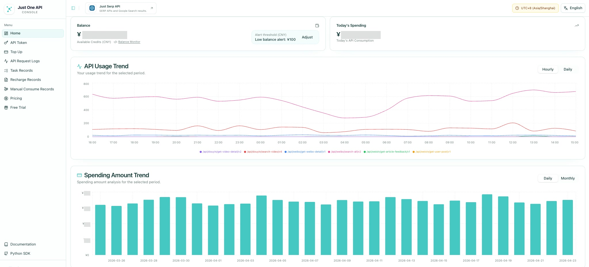

# justoneapi  —— Your Trusted Data Partner 
>[Official Website](https://justoneapi.com/en?utm_source=github.com&utm_medium=referral&utm_campaign=justoneapi_crawl_data_api&utm_content=repo_readme)   |  [API Document](https://docs.justoneapi.com/en?utm_source=github.com&utm_medium=referral&utm_campaign=justoneapi_crawl_data_api&utm_content=repo_readme) | [Python SDK](https://github.com/justoneapi/justoneapi-python)

We are a professional data service provider, offering standard HTTP API services and customized data solutions tailored to your needs.

## Platform Overview

The documentation center helps you browse endpoint health, versioned API paths, request parameters, and platform-specific usage notes.

The console provides API token management, balance visibility, request logs, usage trends, and spending analytics.

## Contact Information

Feel free to contact us with any questions.

[Contact](https://justoneapi.com/en/contact?utm_source=github.com&utm_medium=referral&utm_campaign=justoneapi_crawl_data_api&utm_content=repo_readme)

## Service Overview

See the online API documentation for full request and response details.

<!-- API_LIST_START -->

### Social Media

- Cross-Platform Search (V1)

### Taobao and Tmall

- Product Details (V1)
- Product Details (V4)
- Product Details (V5)
- Product Details (V9)
- Product Reviews (V3)
- Shop Product List (V1)
- Shop Product List (V2)
- Shop Product List (V3)
- Product Search (V1)

### Xiaohongshu (RedNote)

- User Profile (V3)
- User Profile (V4) (Deprecated)
- User Published Notes (V2) (Deprecated)
- User Published Notes (V4)
- Note Details (V1)
- Note Details (V3) (Deprecated)
- Note Details (V7) (Deprecated)
- Note Comments (V2)
- Note Comments (V4)
- Comment Replies (V2)
- Note Search (V2)
- Note Search (V3)
- User Search (V2)
- Share Link Resolution (V3)
- Keyword Suggestions (V1)

### Xiaohongshu Creator Marketplace (Pugongying)

- Creator Profile (V1)
- Data Summary (V1)
- Follower Growth History (V1)
- Follower Summary (V1)
- Similar Creators (V1)
- Creator Feature Tags (V1)
- Creator Content Tags (V1)
- Note Performance Metrics (V1)
- User Published Notes (V1)
- Follower Distribution (V1)
- Cost Effectiveness Analysis (V1)
- Note Details (V1)
- Creator Search (V1)
- Creator Core Metrics (V1)
- Creator Profile (V1) (Deprecated)
- Note Performance Metrics (V1) (Deprecated)
- Follower Distribution (V1) (Deprecated)
- Follower Summary (V1) (Deprecated)
- Follower Growth History (V1) (Deprecated)
- Creator Note List (V1)
- Data Summary (V2) (Deprecated)
- Cost Effectiveness Analysis (V1) (Deprecated)
- Note Details (V1) (Deprecated)
- Creator Core Metrics (V1) (Deprecated)

### Douyin (TikTok China)

- User Profile (V3)
- User Published Videos (V3)
- Video Details (V2)
- Video Search (V4)
- User Search (V2)
- Video Comments (V1)
- Comment Replies (V1)
- Share Link Resolution (V1)

### Douyin E-commerce

- Item Details (V1)

### Douyin Creator Marketplace (Xingtu)

- Creator Profile (V1)
- Creator Link Structure (V1)
- Creator Visibility Status (V1)
- Creator Channel Metrics (V1)
- Creator Order Experience (V1)
- Creator Link Metrics (V1)
- Video Distribution (V1)
- Audience Distribution (V1)
- Marketing Metrics (V1)
- Spread Metrics (V1)
- Conversion Analysis (V1)
- Showcase Items (V1)
- Conversion Resources (V1)
- Cost Performance Analysis (V1)
- Audience Touchpoint Distribution (V1)
- Recommended Videos (V1)
- Follower Distribution (V1)
- Creator Search (V1)
- Item Report Trends (V1)
- Item Report Details (V1)
- Item Report Analysis (V1)
- KOL Comment Keyword Analysis (V1)
- Follower Growth Trend (V1)
- KOL Content Keyword Analysis (V1)
- Author Commerce Spread Info (V1)
- Author Commerce Seeding Base Info (V1)
- Creator Profile (V1) (Deprecated)
- Audience Distribution (V1) (Deprecated)
- Follower Distribution (V1) (Deprecated)
- Marketing Metrics (V1) (Deprecated)
- Spread Metrics (V1) (Deprecated)
- KOL Keyword Search (V1)
- Conversion Analysis (V1) (Deprecated)
- Showcase Items (V1) (Deprecated)
- Creator Link Metrics (V1) (Deprecated)
- Conversion Resources (V1) (Deprecated)
- Creator Link Structure (V1) (Deprecated)
- Audience Touchpoint Distribution (V1) (Deprecated)
- Cost Performance Analysis (V1) (Deprecated)
- Recommended Videos (V1) (Deprecated)
- Follower Growth Trend (V1) (Deprecated)
- KOL Comment Keyword Analysis (V1) (Deprecated)
- KOL Content Keyword Analysis (V1) (Deprecated)
- Author Commerce Spread Info (V1) (Deprecated)
- Author Commerce Seeding Base Info (V1) (Deprecated)
- Video Details (V1) (Deprecated)

### Kuaishou

- User Search (V2)
- User Published Videos (V2)
- Video Details (V2)
- Video Search (V2)
- User Profile (V1)
- Share Link Resolution (V1)
- Video Comments (V1)

### Weibo

- Keyword Search (V2)
- Post Details (V1)
- User Profile (V3)
- User Fans (V1)
- User Followers (V1)
- User Published Posts (V1)
- User Video List (V1)
- TV Video Details (V1)
- Hot Search (V1)
- Post Comments (V1)
- Search User Published Posts (V1)

### Bilibili

- Video Details (V2)
- User Published Videos (V2)
- User Profile (V2)
- Video Danmaku (V2)
- Video Comments (V2)
- Video Search (V2)
- Share Link Resolution (V1)
- User Relation Stats (V1)
- Video Captions (V2)

### JD.com

- Product Details (V1)
- Product Comments (V1)
- Shop Product List (V1)

### WeChat Official Accounts

- User Published Posts (V1)
- Article Engagement Metrics (V1)
- Article Comments (V1)
- Keyword Search (V1)
- Article Details (V1)

### Douban Movie

- Movie Reviews (V1)
- Review Details (V1)
- Subject Details (V1)
- Comments (V1)
- Recent Hot Movie (V1)
- Recent Hot Tv (V1)

### TikTok

- User Published Posts (V1)
- Post Details (V1)
- User Profile (V1)
- Post Comments (V1)
- Comment Replies (V1)
- User Search (V1)
- Post Search (V1)

### TikTok Shop

- Product Search (V1)
- Product Details (V1)

### YOUKU

- Video Search (V1)
- Video Details (V1)
- User Profile (V1)

### Instagram

- User Profile (V1)
- Post Details (V1)
- User Published Posts (V1)
- Reels Search (V1)
- Hashtag Posts Search (V1)

### YouTube

- Video Details (V1)
- Channel Videos (V1)

### Reddit

- Post Details (V1)
- Post Comments (V1)
- Keyword Search (V1)

### Toutiao

- Article Details (V1)
- User Profile (V1)
- App Keyword Search (V1) (Deprecated)
- Web Keyword Search (V2)

### Zhihu

- Column Article Details (V1)
- Answer List (V1)
- Keyword Search (V1)
- Column Article List (V1)

### Amazon

- Product Details (V1)
- Product Top Reviews (V1)
- Best Sellers (V1)
- Products By Category (V1)

### Facebook

- Post Search (V1)
- Get Profile ID (V1)
- Get Profile Posts (V1)

### Twitter

- User Profile (V1)
- User Published Posts (V1)

### Beike

- Resale Housing Details (V1)
- Resale Housing List (V1)
- Community List (V1)

### IMDb

- Release Expectation (V1)
- Extended Details (V1)
- Top Cast and Crew (V1)
- Base Info (V1)
- Redux Overview (V1)
- 'Did You Know' Insights (V1)
- Critics Review Summary (V1)
- Awards Summary (V1)
- User Reviews Summary (V1)
- Plot Summary (V1)
- Contribution Questions (V1)
- Details (V1)
- Box Office Summary (V1)
- Recommendations (V1)
- Keyword Search (V1)
- Streaming Picks (V1)
- News by Category (V1)
- Chart Rankings (V1)
- Countries of Origin (V1)

### Web Page

- HTML Content (V1)
- Rendered HTML Content (V1)
- Markdown Content (V1)

<!-- API_LIST_END -->
